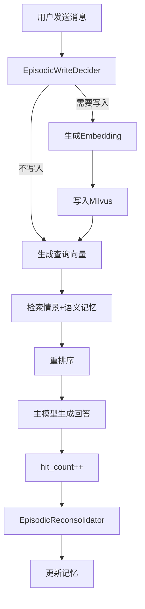
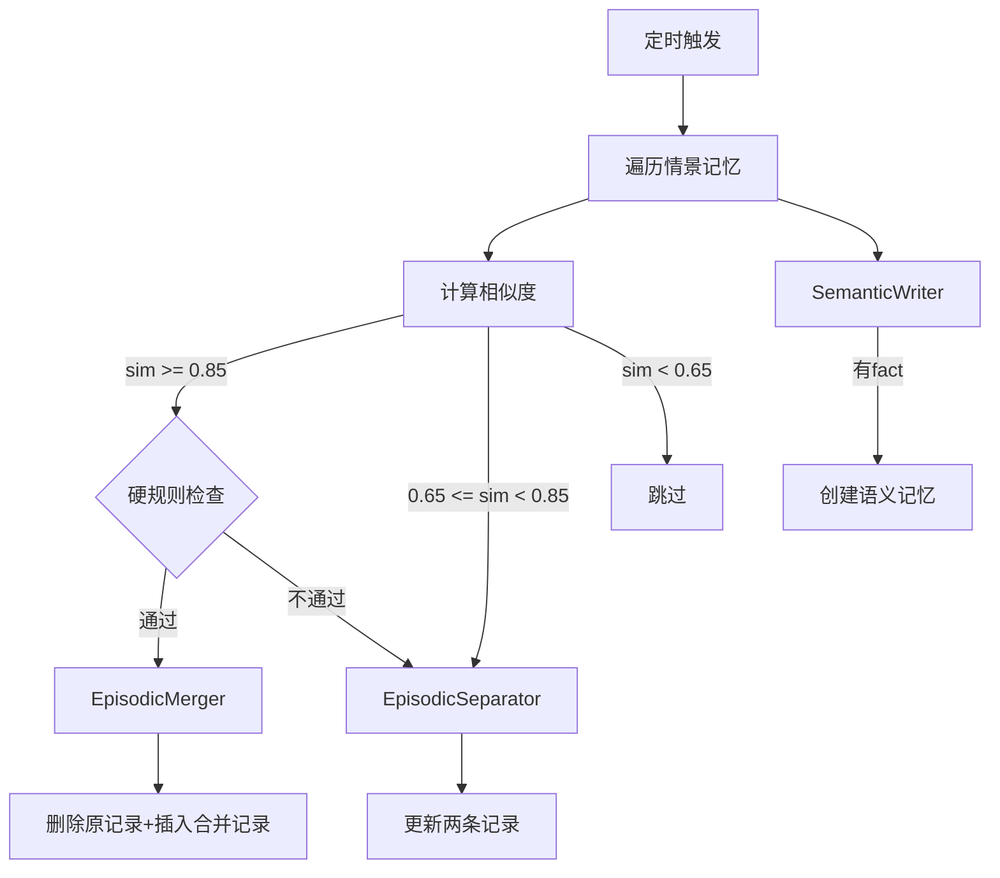

# Design Document

## Overview

本设计文档描述了一个基于认知心理学的AI长期记忆系统的技术架构和实现细节。系统模拟人类海马体的记忆处理机制，实现情景记忆（episodic）和语义记忆（semantic）的编码、巩固、检索和再巩固。

### 核心设计原则

1. **善于记忆，善于遗忘**：倾向于增加记忆信息，保守删除
2. **统一向量检索**：情景和语义记忆使用统一的text字段做embedding，通过filter区分类型
3. **模块化处理器**：每个记忆处理阶段由独立的LLM prompt驱动
4. **mem0风格API**：提供简洁的add/search/update/delete接口

## Architecture

```
┌─────────────────────────────────────────────────────────────────────────────┐
│                              Memory System                                   │
├─────────────────────────────────────────────────────────────────────────────┤
│  ┌─────────────────────────────────────────────────────────────────────┐   │
│  │                         Memory Class (API Layer)                     │   │
│  │  add() | search() | update() | delete() | reset() | consolidate()   │   │
│  └─────────────────────────────────────────────────────────────────────┘   │
│                                    │                                        │
│  ┌─────────────────────────────────┴─────────────────────────────────┐     │
│  │                        Processing Modules                          │     │
│  │  ┌──────────────┐ ┌──────────────┐ ┌──────────────┐               │     │
│  │  │ WriteDecider │ │ Reconsolid.  │ │ SemanticWriter│               │     │
│  │  └──────────────┘ └──────────────┘ └──────────────┘               │     │
│  │  ┌──────────────┐ ┌──────────────┐                                │     │
│  │  │   Merger     │ │  Separator   │                                │     │
│  │  └──────────────┘ └──────────────┘                                │     │
│  └───────────────────────────────────────────────────────────────────┘     │
│                                    │                                        │
│  ┌─────────────────────────────────┴─────────────────────────────────┐     │
│  │                        Infrastructure Layer                        │     │
│  │  ┌──────────────────┐  ┌──────────────────┐  ┌─────────────────┐  │     │
│  │  │  EmbeddingClient │  │    LLMClient     │  │  MilvusClient   │  │     │
│  │  │ (qwen3-embed-4b) │  │ (grok-4.1-fast)  │  │  (memories)     │  │     │
│  │  └──────────────────┘  └──────────────────┘  └─────────────────┘  │     │
│  └───────────────────────────────────────────────────────────────────┘     │
└─────────────────────────────────────────────────────────────────────────────┘
```

### 在线对话流程



### 离线巩固流程



## Components and Interfaces

### 1. Memory Class (主入口)

```python
class Memory:
    """AI记忆系统主类，提供类似mem0的API接口"""
    
    def __init__(self, config: MemoryConfig = None):
        """初始化记忆系统，连接Milvus和OpenRouter"""
        
    def add(self, text: str, user_id: str, chat_id: str, 
            metadata: dict = None) -> List[str]:
        """添加记忆，返回创建的记忆ID列表"""
        
    def search(self, query: str, user_id: str, 
               limit: int = 10) -> List[MemoryRecord]:
        """搜索记忆，返回排序后的记忆列表"""
        
    def update(self, memory_id: int, data: dict) -> bool:
        """更新指定记忆"""
        
    def delete(self, memory_id: int) -> bool:
        """删除指定记忆"""
        
    def reset(self, user_id: str) -> int:
        """删除用户所有记忆，返回删除数量"""
        
    def consolidate(self, user_id: str = None) -> ConsolidationStats:
        """运行巩固流程"""
```

### 2. EmbeddingClient

```python
class EmbeddingClient:
    """Embedding模型客户端"""
    
    def __init__(self, api_key: str, base_url: str, model: str):
        """初始化OpenRouter embedding客户端"""
        
    def encode(self, texts: List[str]) -> List[List[float]]:
        """批量编码文本为向量"""
        
    @property
    def dim(self) -> int:
        """返回向量维度 (2560)"""
```

### 3. LLMClient

```python
class LLMClient:
    """LLM模型客户端"""
    
    def __init__(self, api_key: str, base_url: str, model: str):
        """初始化OpenRouter LLM客户端"""
        
    def chat(self, system_prompt: str, user_message: str) -> str:
        """调用LLM进行对话"""
        
    def chat_json(self, system_prompt: str, user_message: str) -> dict:
        """调用LLM并解析JSON响应"""
```

### 4. MilvusStore

```python
class MilvusStore:
    """Milvus向量存储封装"""
    
    def __init__(self, uri: str, collection_name: str = "memories"):
        """初始化Milvus连接"""
        
    def create_collection(self, dim: int) -> None:
        """创建memories collection"""
        
    def insert(self, entities: List[dict]) -> List[int]:
        """插入记忆记录"""
        
    def search(self, vectors: List[List[float]], filter_expr: str,
               limit: int, output_fields: List[str]) -> List[dict]:
        """向量相似度搜索"""
        
    def query(self, filter_expr: str, output_fields: List[str]) -> List[dict]:
        """条件查询"""
        
    def update(self, id: int, data: dict) -> bool:
        """更新记录"""
        
    def delete(self, ids: List[int] = None, filter_expr: str = None) -> int:
        """删除记录"""
```

### 5. 记忆处理器模块

```python
class EpisodicWriteDecider:
    """情景记忆写入决策器"""
    def decide(self, chat_id: str, turns: List[dict]) -> WriteDecision

class SemanticWriter:
    """语义记忆提取器"""
    def extract(self, episodic_memory: dict) -> SemanticExtraction

class EpisodicMerger:
    """情景记忆合并器"""
    def merge(self, memory_a: dict, memory_b: dict) -> dict

class EpisodicSeparator:
    """情景记忆分离器"""
    def separate(self, memory_a: dict, memory_b: dict) -> Tuple[dict, dict]

class EpisodicReconsolidator:
    """情景记忆再巩固器"""
    def reconsolidate(self, old_memory: dict, current_context: str) -> dict
```

## Data Models

### MemoryConfig

```python
@dataclass
class MemoryConfig:
    milvus_uri: str = "http://115.190.109.17:19530"
    openrouter_api_key: str = ""
    openrouter_base_url: str = "https://openrouter.ai/api/v1"
    embedding_model: str = "qwen/qwen3-embedding-4b"
    llm_model: str = "x-ai/grok-4.1-fast:free"
    embedding_dim: int = 2560
    collection_name: str = "memories"
    k_semantic: int = 5
    k_episodic: int = 5
    t_merge_high: float = 0.85
    t_amb_low: float = 0.65
    merge_time_window_same_chat: int = 1800  # 30分钟(秒)
    merge_time_window_diff_chat: int = 604800  # 7天(秒)
```

### MemoryRecord

```python
@dataclass
class MemoryRecord:
    id: int
    user_id: str
    memory_type: str  # "episodic" | "semantic"
    ts: int
    chat_id: str
    who: str
    text: str
    vector: List[float]
    hit_count: int
    metadata: dict
```

### Milvus Schema

```python
# Collection: memories
# enable_dynamic_field=True

schema = {
    "id": {"type": "INT64", "is_primary": True, "auto_id": True},
    "user_id": {"type": "VARCHAR", "max_length": 128},
    "memory_type": {"type": "VARCHAR", "max_length": 32},
    "ts": {"type": "INT64"},
    "chat_id": {"type": "VARCHAR", "max_length": 128},
    "who": {"type": "VARCHAR", "max_length": 64},
    "text": {"type": "VARCHAR", "max_length": 65535},
    "vector": {"type": "FLOAT_VECTOR", "dim": 2560},
    "hit_count": {"type": "INT64"},
    "metadata": {"type": "JSON"}
}

# 索引配置
index_params = {
    "vector": {"index_type": "AUTOINDEX", "metric_type": "COSINE"},
    "user_id": {"index_type": "AUTOINDEX"},
    "memory_type": {"index_type": "AUTOINDEX"}
}
```

### Episodic Memory Metadata

```python
episodic_metadata = {
    "context": str,      # 背景/场景描述
    "thing": str,        # 具体发生的事情
    "time": str,         # ISO 8601时间字符串
    "chatid": str,       # 同chat_id
    "who": str,          # 记忆主体
    "updates": [         # 可选，更新历史
        {"time": str, "desc": str}
    ],
    "source_chat_ids": List[str],   # 可选，合并来源
    "merged_from_ids": List[int]    # 可选，合并来源ID
}
```

### Semantic Memory Metadata

```python
semantic_metadata = {
    "fact": str,           # 事实描述
    "source_chatid": str,  # 来源会话ID
    "first_seen": str      # 首次发现日期
}
```


## Correctness Properties

*A property is a characteristic or behavior that should hold true across all valid executions of a system-essentially, a formal statement about what the system should do. Properties serve as the bridge between human-readable specifications and machine-verifiable correctness guarantees.*

Based on the prework analysis, the following properties have been identified after eliminating redundancy:

### Property 1: Dynamic Field Storage Consistency

*For any* additional metadata field not in the schema, when stored in a memory record, the field SHALL be retrievable with the same value.

**Validates: Requirements 1.4**

### Property 2: Episodic Memory Field Completeness

*For any* stored episodic memory, the record SHALL contain all required fields: user_id, ts, chat_id, memory_type="episodic", hit_count (initialized to 0), text, vector, and metadata with context, thing, time, chatid, who.

**Validates: Requirements 2.3**

### Property 3: Chitchat and Knowledge Query Filtering

*For any* input that is pure chitchat (greetings, single tokens), objective knowledge questions without personal information, or meaningless fragments, the EpisodicWriteDecider SHALL return write_episodic=false.

**Validates: Requirements 2.4**

### Property 4: Explicit Remember Request Storage

*For any* user message containing explicit "remember this" or similar phrases with personal information, the EpisodicWriteDecider SHALL return write_episodic=true.

**Validates: Requirements 2.5**

### Property 5: Search Result Type Coverage

*For any* search query with a valid user_id, the search results SHALL include both episodic and semantic memories (if they exist) filtered by that user_id.

**Validates: Requirements 3.2**

### Property 6: Search Result Limit Enforcement

*For any* search operation, the number of returned semantic memories SHALL NOT exceed k_semantic, and the number of returned episodic memories SHALL NOT exceed k_episodic.

**Validates: Requirements 3.3**

### Property 7: Hit Count Increment on Retrieval

*For any* memory that is retrieved and used in a conversation, its hit_count SHALL increase by exactly 1.

**Validates: Requirements 3.5**

### Property 8: Reconsolidation Field Preservation

*For any* episodic memory undergoing reconsolidation, the fields metadata.time, chat_id, who, and metadata.who SHALL remain unchanged from the original values.

**Validates: Requirements 4.2**

### Property 9: Reconsolidation Updates Array Growth

*For any* reconsolidation operation, the metadata.updates array length SHALL increase by at least 1.

**Validates: Requirements 4.4**

### Property 10: Merge Threshold Enforcement

*For any* pair of episodic memories with cosine similarity >= T_merge_high (0.85), same who field, and passing time/chat_id constraints, the consolidation process SHALL merge them into a single record.

**Validates: Requirements 5.2**

### Property 11: Separation Threshold Enforcement

*For any* pair of episodic memories with T_amb_low (0.65) <= cosine similarity < T_merge_high (0.85), the consolidation process SHALL call EpisodicSeparator to rewrite them.

**Validates: Requirements 5.3**

### Property 12: Merge Record Count Invariant

*For any* merge operation on two memories, the total record count SHALL decrease by exactly 1 (two deleted, one inserted).

**Validates: Requirements 5.4**

### Property 13: Semantic Memory Field Completeness

*For any* created semantic memory, the record SHALL have memory_type="semantic" and metadata containing fact, source_chatid, and first_seen fields.

**Validates: Requirements 6.6**

### Property 14: Reset Operation Completeness

*For any* user_id, after calling Memory.reset(user_id), there SHALL be zero memories remaining for that user_id.

**Validates: Requirements 8.5**

### Property 18: Same Chat Merge Time Constraint

*For any* pair of memories with the same chat_id, merge SHALL only be allowed if |ts1 - ts2| <= 1800 seconds (30 minutes).

**Validates: Requirements 9.1**

### Property 19: Different Chat Merge Time Constraint

*For any* pair of memories with different chat_ids, merge SHALL only be allowed if |ts1 - ts2| <= 604800 seconds (7 days).

**Validates: Requirements 9.2**

### Property 20: Who Field Merge Constraint

*For any* pair of memories where who1 != who2, the system SHALL NOT merge them.

**Validates: Requirements 9.3**

### Property 21: Merged Record Time Selection

*For any* merge operation, the resulting record's metadata.time SHALL equal the earlier of the two original metadata.time values.

**Validates: Requirements 9.4**

### Property 22: Merged Record Source Tracking

*For any* merge operation, the resulting record's metadata.source_chat_ids SHALL contain both original chat_ids.

**Validates: Requirements 9.5**

## Error Handling

### Milvus Connection Errors

```python
class MilvusConnectionError(Exception):
    """Raised when Milvus connection fails"""
    def __init__(self, uri: str, original_error: Exception):
        self.uri = uri
        self.original_error = original_error
        super().__init__(f"Failed to connect to Milvus at {uri}: {original_error}")
```

### OpenRouter API Errors

```python
class OpenRouterError(Exception):
    """Raised when OpenRouter API call fails after retries"""
    def __init__(self, model: str, attempts: int, last_error: Exception):
        self.model = model
        self.attempts = attempts
        self.last_error = last_error
        super().__init__(f"OpenRouter API failed for {model} after {attempts} attempts: {last_error}")
```

### Retry Strategy

```python
def retry_with_backoff(func, max_retries=3, base_delay=1.0):
    """
    Retry function with exponential backoff.
    Delays: 1s, 2s, 4s
    """
    for attempt in range(max_retries):
        try:
            return func()
        except Exception as e:
            if attempt == max_retries - 1:
                raise
            delay = base_delay * (2 ** attempt)
            time.sleep(delay)
```

### JSON Parsing Fallback

```python
def safe_parse_json(response: str, default: dict) -> dict:
    """
    Parse JSON response with fallback to default.
    Logs error if parsing fails.
    """
    try:
        return json.loads(response)
    except json.JSONDecodeError as e:
        logger.error(f"Invalid JSON response: {e}")
        return default
```

## Testing Strategy

### Dual Testing Approach

本系统采用单元测试和属性测试相结合的方式：

- **单元测试**：验证具体示例、边界情况和错误条件
- **属性测试**：验证应在所有有效输入上成立的通用属性

### Property-Based Testing Framework

使用 **Hypothesis** 库进行属性测试。

```python
# pytest + hypothesis
pip install pytest hypothesis
```

### Test Configuration

```python
from hypothesis import settings, Phase

# 每个属性测试运行至少100次迭代
settings.register_profile("ci", max_examples=100)
settings.load_profile("ci")
```

### Test File Structure

```
tests/
├── __init__.py
├── conftest.py              # pytest fixtures
├── test_memory.py           # Memory class unit tests
├── test_milvus_store.py     # MilvusStore unit tests
├── test_embedding.py        # EmbeddingClient unit tests
├── test_llm.py              # LLMClient unit tests
├── test_processors.py       # Memory processor unit tests
├── properties/
│   ├── __init__.py
│   ├── test_storage_props.py    # Properties 1-4
│   ├── test_search_props.py     # Properties 5-7
│   ├── test_reconsolid_props.py # Properties 8-9
│   ├── test_merge_props.py      # Properties 10-12, 18-22
│   ├── test_semantic_props.py   # Property 13
│   └── test_api_props.py        # Property 14
└── integration/
    ├── __init__.py
    └── test_full_flow.py    # End-to-end integration tests
```

### Property Test Annotation Format

每个属性测试必须使用以下格式注释：

```python
# **Feature: ai-memory-system, Property 1: Dynamic Field Storage Consistency**
@given(st.text(min_size=1), st.text(min_size=1))
def test_dynamic_field_storage(field_name, field_value):
    """
    **Validates: Requirements 1.4**
    For any additional metadata field, it should be retrievable with the same value.
    """
    # Test implementation
```

### Key Test Strategies

1. **Generators for Memory Records**
   - Generate valid episodic memories with random but valid fields
   - Generate semantic memories with random facts
   - Generate edge cases: empty strings, unicode, very long text

2. **Milvus Test Isolation**
   - Use unique collection names per test run
   - Clean up collections after tests
   - Consider using Milvus Lite for local testing

3. **LLM Response Mocking**
   - Mock LLM responses for deterministic testing
   - Test with actual LLM calls in integration tests only

4. **Similarity Score Testing**
   - Generate pairs of texts with known similarity ranges
   - Verify threshold-based decisions

### Example Property Test

```python
from hypothesis import given, strategies as st
import pytest

# **Feature: ai-memory-system, Property 12: Merge Record Count Invariant**
@given(
    memory_a=episodic_memory_strategy(),
    memory_b=episodic_memory_strategy()
)
def test_merge_record_count_invariant(memory_store, memory_a, memory_b):
    """
    **Validates: Requirements 5.4**
    For any merge operation on two memories, the total record count 
    SHALL decrease by exactly 1.
    """
    # Setup: ensure memories are mergeable
    memory_b["who"] = memory_a["who"]
    memory_b["ts"] = memory_a["ts"] + 100  # within time window
    
    # Insert both memories
    ids = memory_store.insert([memory_a, memory_b])
    initial_count = memory_store.count(filter=f"user_id == '{memory_a['user_id']}'")
    
    # Perform merge
    merger = EpisodicMerger(llm_client)
    merged = merger.merge(memory_a, memory_b)
    
    # Delete originals and insert merged
    memory_store.delete(ids=ids)
    memory_store.insert([merged])
    
    final_count = memory_store.count(filter=f"user_id == '{memory_a['user_id']}'")
    
    # Verify: count decreased by exactly 1
    assert final_count == initial_count - 1
```

### Unit Test Examples

```python
class TestEpisodicWriteDecider:
    def test_chitchat_not_stored(self, decider):
        """Test that pure greetings are not stored"""
        result = decider.decide("chat-1", [{"role": "user", "content": "你好"}])
        assert result.write_episodic == False
    
    def test_remember_request_stored(self, decider):
        """Test that explicit remember requests are stored"""
        result = decider.decide("chat-1", [
            {"role": "user", "content": "请记住我是北京大学的学生"}
        ])
        assert result.write_episodic == True

class TestMergeConstraints:
    def test_different_who_not_merged(self, consolidator):
        """Test that memories with different who are not merged"""
        mem_a = create_memory(who="user")
        mem_b = create_memory(who="friend")
        
        result = consolidator.should_merge(mem_a, mem_b)
        assert result == False
```
