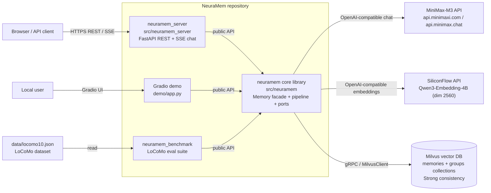
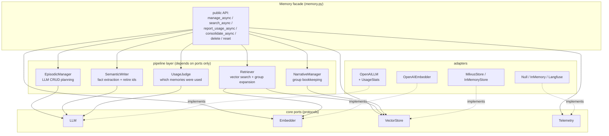
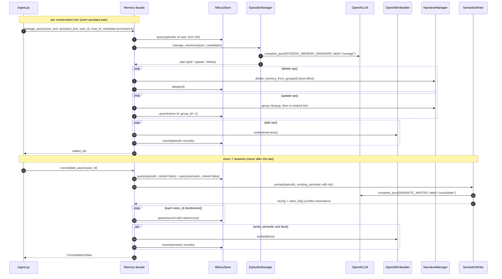
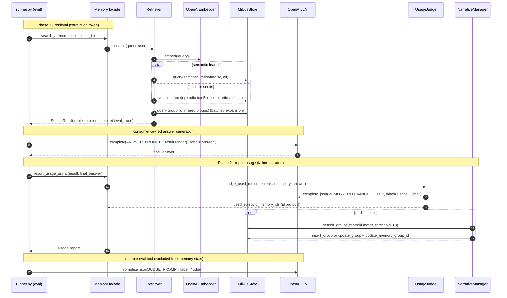
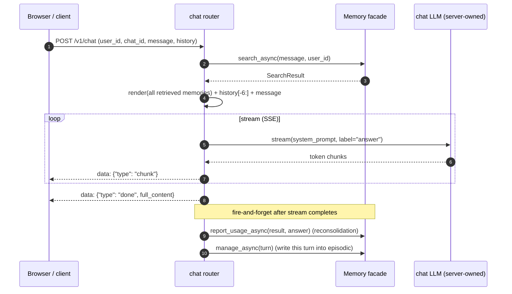

# NeuraMem 架构总览（Architecture Overview）

> 生成于 2026-08-19，基于 commit `8469cb6` 及当前工作树的代码实态。
> 目标读者：新加入的开发者、评审者、以及需要理解全链路的维护者。
> 目标问题：这个仓库有什么、每个部分干什么、一条数据从写入到被检索增强的完整路径是怎样的。

---

## 1. 系统总览（Container 视图）

NeuraMem 是一个 **AI 长期记忆系统**：把对话提炼为情景/语义/叙事三类记忆存入向量库，并在后续提问时检索出来增强 LLM 回答。仓库内是"**一个核心库 + 三个消费者**"的结构——服务端、演示应用、评测套件都只是库的公共 API 消费者，不碰任何私有属性。

要点：

- **库不拥有答题权**：`search_async` 只返回记忆（`SearchResult`），由消费者用自己的 LLM 生成回答，再用 `report_usage_async` 回写使用情况——这是"两段式闭环"（见 §4.2）。
- **评测与服务端走同一条闭环**，因此跑分数字对产品行为有代表性。
- 外部依赖三个：LLM、Embedding、Milvus，全部通过端口适配器隔离（见 §3）。

---

## 2. 目录树与职责（每项一句话）

- `src/neuramem/` — **核心库**：记忆系统本体，纯库形态，无任何入口进程
  - `memory.py` — `Memory` 门面类：全部公共 API（manage/search/report_usage/consolidate/delete/reset），编排 pipeline，遥测 span 边界
  - `config.py` — 分层配置 `MemoryConfig`：LLM_/EMBEDDING_/STORE_/RETRIEVAL_/LANGFUSE_ 前缀的子配置，构造期校验、错误配置即刻失败
  - `prompts.py` — prompt 资产单一源：episodic 管理 / semantic 提炼 / usage 判断三套模板 + canonical 答题 builder（`build_answer_prompt`，benchmark/server/demo 共用）
  - `core/` — 领域内核（零 IO 依赖）
    - `models.py` — Pydantic 值对象：`MemoryRecord`（含 retired 墓碑）、`MemoryFilter`、`SearchResult`（闭环 correlation token + transient `RetrievalTrace`）、`UsageReport`、`LLMUsage` 等
    - `ports.py` — 四个端口协议：`LLM` / `Embedder` / `VectorStore` / `Telemetry`（pipeline 唯一可依赖的接口面）
    - `retry.py` — `RetryExecutor`：HTTP 感知的重试分类（408/429/5xx/连接错误），尊重 retry-after，指数退避+去风暴抖动
    - `exceptions.py` — 领域异常：`MilvusConnectionError`、`LLMCallError`、`LLMParseError` 等
  - `pipeline/` — 业务逻辑层（只依赖 ports）
    - `episodic.py` — `EpisodicManager`：LLM 决定本轮对话的 add/update/delete 计划（解析失败即抛 `LLMParseError`）
    - `semantic.py` — `SemanticWriter`：从 episodic 批量提炼语义事实，并返回被新证据矛盾、需要淘汰的旧语义 id
    - `usage_judge.py` — `UsageJudge`：判断检索出的 episodic 中哪些真的被回答用到（id 协议，失败保守返回空）
    - `narrative.py` — `NarrativeManager`：叙事组簿记——按质心相似度聚类、精确重算质心、删成员/空组清理
    - `retrieval.py` — `Retriever`：向量检索 + 叙事组扩展（单次批量查询扩组，永久过滤 retired），同时保留 seed/扩展/score/耗时 trace
  - `llm/openai_adapter.py` — `OpenAILLM`：LLM 端口实现；`UsageStats`（contextvars 每题一 scope）、usage 单点解析、JSON 修复重试一次
  - `embed/openai_adapter.py` — `OpenAIEmbedder`：Embedding 端口实现（原生 async，dim 来自配置）
  - `store/` — 向量存储端口实现
    - `milvus.py` — `MilvusStore`：pymilvus 适配器，线程池桥接 async，Strong 一致性，schema 与 legacy 逐字段兼容
    - `inmemory.py` — `InMemoryStore`：测试/无 Milvus 环境的内存实现（同一端口契约）
    - `filters.py` — `MemoryFilter` → Milvus 表达式的编译器（杜绝字符串拼接注入）
  - `telemetry/` — 遥测端口三实现：`null.py`（默认零成本）、`memory.py`（内存版，测试/跑分用）、`langfuse.py`
- `src/neuramem_server/` — **REST 服务**（库的消费者 #1）
  - `app.py` — FastAPI 装配：lifespan 预热单例、CORS、异常处理器、路由挂载
  - `deps.py` — 依赖注入：`get_memory_system` / `get_chat_llm`（lru_cache 进程级单例，服务端自持答题 LLM）
  - `schemas.py` — Pydantic 请求/响应契约（与 legacy /v1/* API 逐字段一致；user_id 正则校验）
  - `routers/chat.py` — `POST /v1/chat`：SSE 流式回答，回答完成后 fire-and-forget 回写闭环 + manage
  - `routers/memories.py` — `/v1/memories/*`：manage / search / delete / reset / consolidate 的 REST 包装
  - `exceptions.py` — 领域异常 → HTTP 状态码 + error_code 的映射

---

## 3. 库内部分解（Component 视图）

分层规则（architecture_target.md）：**core 零 IO → pipeline 只依赖 ports → adapters 实现 ports → facade 编排**。依赖方向单向向下，消费者（server/demo/benchmark）只 import facade 与 ports。

---

## 4. 核心工作链路（时序图）

三条链路共用同一套底层：A 是**写路径**（记忆怎么进来、怎么巩固、怎么淘汰），B/C 是**读路径**的两种消费者形态（评测与在线服务），B/C 共享"两段式闭环"。

### 4.1 写路径：ingest（manage 逐轮 + consolidate 每 7 session）

设计要点：**冲突淘汰是墓碑不是删除**（`retired=true` 永久过滤，物理删除只发生在 reset）；update 用 upsert 保持 id 稳定并先做组清理；consolidate 解析失败保守跳过（语义不在答题关键路径上）。

### 4.2 读路径：两段式检索闭环（eval runner 消费者）

设计要点：`SearchResult` 是纯数据 correlation token，两阶段之间消费者可做任何事；其中的 transient `retrieval_trace` 记录 seed/expanded/semantic ids、group 扩展、每条命中的 distance/score/source 和耗时，不写回记忆表；`report_usage_async` 全程失败隔离（judge 失败返回空、异常吞掉告警）——**回写通道永远不能弄断答题路径**；usage judge 用 id 协议而非文本匹配，LLM 改写措辞不再丢分配。LoCoMo ingest 通过 `metadata` 写入扁平 `provenance_*` 来源字段，runner 还会为每题落一份 trace JSONL，并同时计算文本 evidence recall 与 provenance recall。

### 4.3 在线路径：server `/v1/chat`（SSE 流式）

与评测链路（§4.2）的差异点：SSE 流式输出；记忆链路与 benchmark runner 完全同构（同一 `build_answer_prompt`、全量记忆不截断、时间锚点为当前年、回写喂 `extract_final_answer` 后的最终答案），差异仅在时机——闭环与本轮 manage 作为后台任务在流结束后执行（强引用防 GC），产品边聊边写（评测刻意冻结）；`/v1/memories/*` 另提供 manage/search/consolidate/delete/reset 的同步 REST 包装。

---

## 5. 关键设计决策速览

| # | 决策 | 位置 | 一句话理由 |
|---|------|------|-----------|
| 1 | 两段式闭环 + correlation token | `memory.py` ch.11 | 检索与回写解耦，消费者持有答题权 |
| 2 | usage judge 走 id 协议（异常留痕） | `usage_judge.py` #14 | 文本匹配在 LLM 改写时静默丢失分配；幻觉 id/坏值不再静默丢弃，逐项容错并记入 `UsageReport` 与 trace |
| 3 | retired 墓碑（冲突淘汰） | `models.py` #20 / `retrieval.py` | 淘汰可追溯，物理删除只留 reset 一条路 |
| 4 | Milvus Strong 一致性 | `milvus.py` | Session/Bounded 级别下读后写不可见，破坏闭环 |
| 5 | 单 groups 集合 + user_id 字段 | `milvus.py` #15 | 集合数不随租户增长 |
| 6 | 组扩展合并为一次批量查询 | `retrieval.py` #19 | 消 N+1 |
| 7 | upsert 稳定 id | `milvus.py` #17 | update 不再 delete+add，id 引用不漂移 |
| 8 | 结构化 MemoryFilter | `filters.py` #16 | 过滤条件不拼字符串，注入无门 |
| 9 | SDK max_retries=0，重试归 RetryExecutor | `llm/openai_adapter.py` | 重试预算可预测可观测，不被 SDK 静默翻倍 |
| 10 | UsageStats contextvars scope | `llm/openai_adapter.py` | 每题一 scope，快照即增量，线程/任务归属正确 |
| 11 | 失败隔离三条铁律 | facade 各处 | 回写不弄断答题、语义不保守不写、组清理尽力而为 |
| 12 | server/demo 自持答题 LLM | `deps.py` ch.9 | 依赖方向不倒置，facade 不被撬开 |

---

## 6. 阅读与维护说明

- **阅读顺序建议**：§1 总览 → §2 目录树 → §4.2 闭环（系统的灵魂）→ 其余按需。
- **刻意省略**：测试用例细节、遥测 span 数据结构、kmeans1d 数值细节、RUN_RECORD 的历史跑分、价格表机制——它们不改变结构理解。
- **维护约定**：改公共 API 必须同步 `core/ports.py`（若动端口）与本文档的 §3/§4；工作流与口径变更记录在 `neuramem_benchmark/RUN_RECORD.md`；目标架构的权威定义始终以 `docs/architecture_target.md` 为准，本文档是它的"实态投影"。
- 图表全部为 Mermaid 源码，可直接在 GitHub 渲染或用 mermaid-cli 导出。
