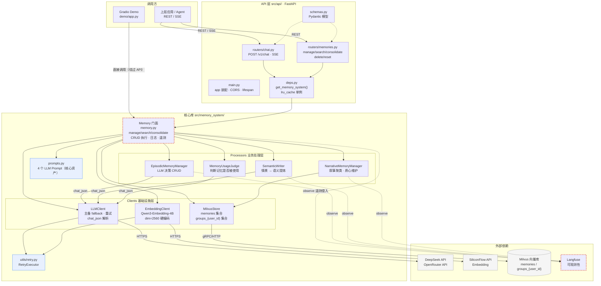
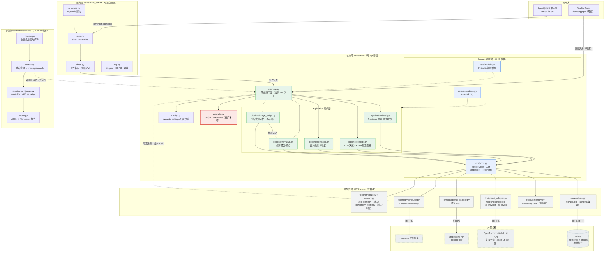

# NeuraMem 目标架构（优化后）

> **Goal**: 展示 NeuraMem 重构后的目标架构，并逐项说明相对现状的调整及其与三大目标（架构干净 / 生产接口与包 / 评测 pipeline）的对应关系。
> **定位**: 公开通用的 AI 记忆库（与 mem0 / Zep / MemGPT 同类定位）——独立发行、通用 API（manage/search/consolidate）、公开评测（LoCoMo），不绑定任何业务项目；parlasoul-backend 是首个真实消费者，其业务改造只经通用机制（metadata / filter / 端口注入）接入，不进核心模型。
> **Type**: Container/Component 级架构图（目标态）
> **Date**: 2025 年

## 〇、原架构图（对照参考）

> 重构前的现状架构，与下方的目标架构对比阅读。问题点明细见 architecture_current.md。



## 一、目标架构图



## 二、核心调整（现状 → 目标）

| # | 现状 | 目标 | 对应要求 |
|---|---|---|---|
| 1 | 不可安装：无 pyproject.toml，源码直跑 uvicorn | **单发行物 pyproject.toml**：neuramem 核心库 + neuramem_server 服务层，extras 区分 [server] [benchmark] [test] | 生产接口/包 |
| 2 | memory_system 内部无边界，Facade 734 行 | **领域层（core）与应用层（pipeline）分离**：core 零 IO 依赖，pipeline 只依赖 core 的 Ports | 架构干净 |
| 3 | 无抽象接口，Facade 直接 new 具体 client | **端口-适配器（Hexagonal）**：core/ports.py 定义 VectorStore / LLM / Embedder / Telemetry 四个 Protocol，Milvus/OpenAI/Langfuse 均为可替换适配器 | 架构干净 + 二次开发 |
| 4 | search 叙事扩展逻辑（约 120 行）内嵌 Facade | **独立 Retriever**（pipeline/retrieval.py），Facade 只做编排 | 架构干净 |
| 5 | @observe 遥测侵入全部核心代码，与 Langfuse 强耦合 | **Telemetry 端口 + Null/Langfuse 双适配器**，默认 Null，核心代码零遥测依赖 | 架构干净 + 二次开发 |
| 6 | store 返回裸 dict，API 层手工转换 | **Pydantic 模型贯穿三层**（core/models.py），删除手工字段拷贝 | 架构干净 |
| 7 | 同步/异步混用，asyncio.to_thread 多层嵌套 | **async-first**：store/embed 原生 async，同步方法降级为薄 wrapper | 架构干净 |
| 8 | 配置为 dataclass + os.getenv，无校验；双通道 fallback（主 DeepSeek + 备 OpenRouter/GLM） | **pydantic-settings 分层配置**（LLM/Embed/Store/Retrieval 子模型）+ 校验；**完全删除 fallback**，LLM 收敛为单一 OpenAI-compatible provider（base_url + api_key + model，参考 pi-mono 模式） | 生产接口/包 |
| 9 | 2560 维三处硬编码，换模型必须同步改 | **维度单一来源**：从 embedding 元数据推导，schema 构建统一引用 | 架构干净 |
| 10 | 测试依赖真 Milvus | **InMemoryStore 适配器**：实现同一 VectorStore 端口，单元/属性测试零外部依赖 | 生产接口/包 |
| 11 | 无评测体系 | **benchmark/ 独立评测包**：LoCoMo 专用（数据加载 + 对话重放 runner + recall@k 规则指标 + LLM-as-judge + 报告），不做多数据集抽象 | 评测 pipeline |
| 12 | demo 与 routers 重复实现上下文构建 | demo 复用核心库公共 API，删除重复逻辑 | 架构干净 |
| 13 | API 层与核心库同包、不可单独部署 | **neuramem_server 独立包**：服务层与库分离，库可被任意应用 import | 生产接口/包 |
| 14 | 再巩固闭环缺失：usage_judge → 叙事分组的调用只存在于 demo 路径，服务层触发 manage 后记忆永远停在 group_id=-1，检索的叙事组扩展形同虚设 | **完整闭环**：search → 回答 → usage_judge → assign_to_narrative_group，由 pipeline 统一编排，服务层与 demo 共用 | 架构干净 + 业务正确性 |
| 15 | 每用户一个 groups_{user_id} 集合（Milvus 集合数上限千级，多租户规模不可行） | **单一 groups 集合 + user_id 字段过滤**（与主集合同构），集合数恒定 | 架构干净 + 生产接口 |
| 16 | user_id 直接字符串拼接进 Milvus 过滤表达式（含引号即破坏表达式/注入类风险） | API 层校验 user_id 格式（如 ^[A-Za-z0-9_-]{1,64}$）+ store 层提供结构化过滤器 | 生产接口/包 |
| 17 | update 用 delete+add 实现（记忆 id 变化、两步之间崩溃丢数据） | **Milvus upsert 原地更新**（id 稳定、单步原子；narrative 已用 upsert 改 group_id，可行性已验证） | 生产接口/包 |
| 18 | 流式回答不解析 usage，token 成本不可见 | **LLM 适配器聚合 usage**（prompt/completion/cache/reasoning tokens + 按定价表算 cost），供监控与评测成本统计（参考 pi-mono parseChunkUsage，见 6.5） | 评测 pipeline + 生产 |
| 19 | search 对每个叙事组各发一次 query（N+1） | 合并为单次 group_id in [...] 查询 | 架构干净 |
| 20 | consolidate 只增不减：旧语义记忆被新事实否定时仍保留 | 增量合并 + **冲突淘汰**：新事实与旧语义记忆矛盾时标记旧记录待淘汰 | 业务正确性 |

## 三、三大要求的落实

### 1. 架构干净

- 依赖单向且向内：server → 编排 → domain ← 适配器；domain 不 import 任何 IO 依赖，可在无外部服务下完整测试
- 每个类职责单一：Facade 只剩编排（约为原 1/3 体量），检索/编码/巩固/聚类/判断各有归属
- 遥测、存储、LLM、Embedding 全部接口化，新增实现（如 Chroma、本地模型）只加适配器，不动业务代码

### 2. 生产接口/包

- pip install neuramem 即得核心库：from neuramem import Memory, MemoryConfig, MemoryRecord；顶层 __init__.py 只导出公共 API，附带 py.typed
- 存储格式兼容：Milvus collection schema 不变，老数据直接可用；/v1/* REST 契约不变
- 服务层可独立部署（neuramem_server），也可被现有 FastAPI 应用挂载（app.include_router）
- 配置即代码：pydantic-settings 校验 + .env 覆盖，错误配置启动即失败而非运行期爆炸

### 3. 评测 pipeline

- **评测数据集仅 LoCoMo**（Long-Term Conversation Memory，对话记忆评测集）：locomo.py 单文件负责数据加载与解析（多 session 对话轮次 + 标注 QA + evidence），**不做多数据集 adapter 抽象**——当前只有单一评测目标，通用框架属于过度设计；将来确有第二个数据集需求时再按需抽象（YAGNI）
- 两级指标分离：**recall@k**（不调 LLM，验证检索出的记忆是否包含 ground-truth evidence）+ **端到端 accuracy**（LLM-as-judge 按 LoCoMo 官方 rubric 0/4 打分）
- **无记忆 baseline 对照组**：同一批 QA 跑"纯 LLM 回答（不注入记忆）"作为对照，报告两组准确率差（memory uplift）——量化记忆系统本身带来的增益，是评测报告最有说服力的输出
- 对话重放 runner：按时间序把对话喂给 manage_async 模拟真实使用，再对 QA 执行 search → 回答 → 打分，支持抽样与固定 seed 复现、--max-queries 成本控制
- 评测对象用公共 API（Memory 接口）抽象，未来可与 mem0 等对照系统横向对比

## 四、目标目录结构

```
NeuraMem/
├── pyproject.toml              # 单发行物；extras: [server] [benchmark] [test]
├── src/
│   ├── neuramem/               # 核心库（可安装、py.typed）
│   │   ├── memory.py           # 薄编排门面（公共 API）
│   │   ├── config.py           # pydantic-settings 分层配置
│   │   ├── prompts.py          # 保留原样（核心资产）
│   │   ├── core/               # 领域层：models / ports / exceptions / retry
│   │   ├── pipeline/           # retrieval / episodic / semantic(+淘汰) / narrative / usage_judge 闭环
│   │   ├── llm/  embed/  store/  telemetry/   # 适配器（各含具体实现）
│   │   └── py.typed
│   └── neuramem_server/        # FastAPI 服务层（可独立部署）
│       ├── app.py  routers/  schemas.py  deps.py  exceptions.py
├── benchmark/                  # 评测 pipeline（LoCoMo 专用）
│   ├── locomo.py  runner.py  metrics.py  judge.py  report.py
├── demo/                       # 瘦身：复用核心库公共 API
└── tests/                      # 单元/属性测试（InMemoryStore 免外部依赖）+ telemetry conformance + 集成
```

## 五、与原架构的对应关系（迁移锚点）

| 原路径 | 新路径 | 说明 |
|---|---|---|
| src/memory_system/memory.py | src/neuramem/memory.py | 瘦身为编排 |
| src/memory_system/processors/memory_manager.py | src/neuramem/pipeline/episodic.py | +候选选择 |
| src/memory_system/processors/semantic_writer.py | src/neuramem/pipeline/semantic.py | +增量合并 |
| src/memory_system/processors/narrative_memory_manager.py | src/neuramem/pipeline/narrative.py | 逻辑不变 |
| src/memory_system/processors/memory_usage_judge.py | src/neuramem/pipeline/usage_judge.py | 逻辑不变 |
| （search 叙事扩展内嵌段） | src/neuramem/pipeline/retrieval.py | 新抽出 |
| src/memory_system/clients/llm.py | src/neuramem/llm/openai_adapter.py | 删 fallback · 单 provider · 全 async |
| src/memory_system/clients/embedding.py | src/neuramem/embed/openai_adapter.py | 原生 async |
| src/memory_system/clients/milvus_store.py | src/neuramem/store/milvus.py | schema 兼容 + groups 单集合改造（#15） |
| — | src/neuramem/store/inmemory.py | 新增 |
| src/memory_system/config.py | src/neuramem/config.py | pydantic-settings |
| src/memory_system/exceptions.py | src/neuramem/core/exceptions.py | 不变 |
| src/memory_system/utils/retry.py | src/neuramem/core/retry.py | 不变 |
| src/memory_system/prompts.py | src/neuramem/prompts.py | 原样保留 |
| src/api/* | src/neuramem_server/* | 契约不变 |

---

## 六、LLM 客户端设计（OpenAI-compatible · 参考 pi-mono）

> pi-mono（Vercel AI SDK monorepo）参考实现：
> - packages/ai/src/api/openai-completions.ts —— createClient（SDK + baseURL 注入）、detectCompat（服务商差异检测）、buildParams
> - packages/ai/src/utils/provider-retry.ts —— 单 provider 重试策略

### 6.1 单 provider，无 fallback

- 现状的 primary + fallback 双通道（DeepSeek 主 + OpenRouter 备；且 fallback_model 配置缺失，备用通道实际从未生效）**整体删除**
- 目标：一个 LLMClient 只对接一个 OpenAI-compatible 服务商，连接参数完全由配置决定：

```python
class LLMConfig(BaseModel):
    base_url: str  # 任意 OpenAI-compatible 端点（api.deepseek.com、open.bigmodel.cn、自建 vLLM 等）
    api_key: str
    model: str
    max_retries: int = 3
```

- 对应 pi-mono createClient 模式：官方 OpenAI SDK + baseURL 注入，即 `openai.OpenAI(api_key=..., base_url=...)`，不手写 HTTP 协议
- 切换服务商 = 改配置，不涉及代码；多服务商并存 = 多个 LLMClient 实例（由使用方显式创建），系统自身不做自动切换
- Embedding 同理：EmbeddingClient 已是 OpenAI-compatible（base_url + api_key + model），维持单 provider 模式

### 6.2 兼容性检测（pi-mono detectCompat 思想）

- 按 base_url / provider 指纹自动适配服务商协议差异，例如：
  - deepseek.com → 请求参数用 max_tokens（而非 max_completion_tokens）、thinking 内容走 deepseek 专属格式
  - 其余 → 默认 OpenAI 行为
- 初期只需 DeepSeek 指纹 + 默认分支两条路径，随实际接入的服务商增长再扩展
- 自动检测结果可被显式配置覆盖（对应 pi-mono 的 model.compat 覆盖机制）

### 6.3 重试策略（pi-mono provider-retry 模式）

- **只重试可恢复错误**：408 / 409 / 429 / 5xx，或服务端 x-should-retry 头显式指示；其余 4xx 一律不重试，直接抛错
- **退避策略**：优先尊重服务端 retry-after / retry-after-ms 头；否则指数退避（0.5 * 2^n，上限 8s）+ 25% 随机抖动，避免重试风暴
- **可中断**：重试等待可被取消（asyncio task cancellation），避免请求取消后仍空等
- 全部重试用尽后抛出结构化错误（含 HTTP status / headers / body），由上层决定处理方式

### 6.4 对现有代码的影响

| 项 | 动作 |
|---|---|
| RetryExecutor（utils/retry.py） | 保留，但重试范围收敛为 408/409/429/5xx（现状是 retryable_exceptions 默认全 Exception，过宽） |
| LLMClient 双通道逻辑 | 删除 fallback client / fallback_model / 主备切换分支 |
| config 的 llm_fallback_* / glm_* 字段 | 删除，收敛为单一 LLMConfig |
| chat / chat_json / chat_stream_async 签名 | 不变，processors 与 prompts 零改动 |

### 6.5 Token 用量计量（参考 pi-mono parseChunkUsage）

pi-mono 参考：packages/ai/src/api/openai-completions.ts 中 stream 内对 chunk.usage 的处理（约 449-461 行）与 parseChunkUsage（1374-1412 行）。

- **流式场景**：OpenAI-compatible 协议在流的最后一个 chunk 携带完整 usage——遍历 chunk 时发现 `chunk.usage` 即解析并聚合（一次会话只出现一次）；**兼容分支**：部分服务商（如 Moonshot）把 usage 放在 `choice.usage` 而非 `chunk.usage`，两个位置都检查
- **字段映射**（parseChunkUsage 语义）：
  - input = prompt_tokens - cache_read - cache_write；output = completion_tokens
  - cache_read = prompt_tokens_details.cached_tokens（或 prompt_cache_hit_tokens）；cache_write = prompt_tokens_details.cache_write_tokens
  - reasoning = completion_tokens_details.reasoning_tokens（OpenAI 已包含在 completion_tokens 内，不重复相加）
  - total = input + output + cache_read + cache_write
  - **缓存语义**：cached_tokens 是缓存命中（读），不从中扣除 cache_write，否则合规服务商被低估（pi-mono 注释引用的 OpenRouter/DS4 契约）
- **成本计算**：usage 各分量 × 模型定价表（区分 input / output / cache_read / cache_write 单价），得到单次调用 cost
- **用途**：① 评测报告输出每样本 token 与成本（成本控制）；② 生产侧监控告警；③ chat_json / chat 响应同步带回 usage（非流式接口）
- **落地形态**：LLM 适配器返回 `{ content / stream chunks, usage: { input, output, cacheRead, cacheWrite, reasoning, total, cost } }`，由 telemetry 记录，不侵入 processors 业务逻辑

#### 6.5.1 与 Langfuse 的分工（不冲突，边界明确）

两者看似重叠（都在收集 token 用量），实际是"**数据生产 vs 数据消费**"的关系，按以下规则划清边界：

1. **LLM 适配器是 usage 的唯一解析点**：无论是否启用 Langfuse，适配器都解析 usage（pi-mono 模式）。原因：评测/CI/本地默认跑 Null telemetry，没有 Langfuse 实例——若用量只依赖 Langfuse 自动 instrumentation，评测就拿不到 token 与成本数据。评测成本统计是 6.5 的第一用途，必须脱离 Langfuse 成立。
2. **Langfuse 只是消费者之一**：LangfuseTelemetry 适配器把适配器解析好的结构化 usage 写入 Langfuse generation（traces 层面仍记录完整链路）；NullTelemetry 则写入本地结构化日志。两者同一数据源，只是出口不同。
3. **禁止双份解析**：不启用 langfuse 的 OpenAI SDK 自动 instrumentation（langfuse 包装的 OpenAI 客户端 / 自动钩子），否则同一请求的 usage 会被解析两次、上报两次，Langfuse 后台统计翻倍。约定：LLM 调用一律走原生 OpenAI SDK（6.1 的 baseURL 注入），usage 由适配器统一解析后经 Telemetry 端口上报。
4. **数据流**：LLM API 响应 → LLM 适配器解析 usage（唯一解析点）→ Telemetry 端口 → NullTelemetry（本地日志，评测直接消费）/ LangfuseTelemetry（写入 Langfuse）。
5. **评测独立于遥测**：benchmark 的 runner 直接读 LLM 适配器返回的 usage 生成成本报告，不经过 Langfuse；Langfuse 只服务于生产可观测性。

---

## 七、Telemetry 设计（参考 pi-mono）

> pi-mono 参考：packages/telemetry（@earendil-works/pi-telemetry）——厂商中立的遥测契约包：TelemetryContext / TelemetrySpan 回调契约、NOOP 默认实现、InMemory 参考实现、adapter conformance 测试、声明式 typed schema。

### 7.1 设计原则（从 pi-mono 提炼）

1. **厂商中立契约**：核心只定义 span 生命周期（startSpan / addEvent / setAttributes / setStatus），不依赖任何具体后端——无 exporter、无全局 current-span 状态、无后端 SDK 依赖。OpenTelemetry / Sentry / Langfuse / 日志都是适配器。
2. **显式上下文，非隐式全局**：telemetry context 作为参数显式传递（默认 NOOP），不依赖全局单例。对比现状的 get_client() 隐式全局——不可测试、无法多实例隔离。
3. **遥测不影响业务**：span 是诊断数据不是业务状态；NOOP 实现零副作用；span 回调异常不得改变业务结果；业务异常自动转为 span error status。
4. **Schema 与实现分离**：各包定义自己的 domain schema（span 名、start/end 属性、必填标记、事件、父级约束），类型系统保证埋点与 schema 一致。

### 7.2 NeuraMem 落地映射

| pi-mono | neuramem |
|---|---|
| TelemetryContext / TelemetrySpan 契约 | core/ports.py：Telemetry 协议（start_span / add_event / set_attributes / set_status） |
| NOOP_TELEMETRY_CONTEXT | telemetry/null.py：默认零开销 |
| InMemoryTelemetryContext | telemetry/memory.py：内存参考实现（spans/events/status 记录，异常自动记 error status） |
| adapter conformance 测试 | tests/telemetry/conformance.py：对任意适配器跑统一契约测试（第三方实现适配器时复用） |
| typed schema（TS 类型推断） | 首版用 Pydantic 定义 span 契约（span 名 / 属性集 / 必填标记），测试约束一致性 |
| 显式 context 参数传递 | 依赖注入：Memory 构造时注入 Telemetry（等价，避免隐式全局） |

### 7.3 注入与使用

```python
# 默认：无遥测（零开销，评测/测试/本地）
memory = Memory(config, telemetry=NullTelemetry())

# 生产：Langfuse 适配器（server 层装配）
memory = Memory(config, telemetry=LangfuseTelemetry(secret_key=..., public_key=..., host=...))

# 测试/评测：内存实现（可断言 span 树、生成报告）
memory = Memory(config, telemetry=InMemoryTelemetry())
```

- pipeline 组件通过构造注入拿到 Telemetry（或由 Facade 统一传入），核心代码零遥测依赖
- 遥测点只发生在端口边界：每次 LLM 调用、检索、manage / consolidate 各是一个 span
- usage（6.5）解析后作为 span 属性经同一端口上报（与 Langfuse 的分工见 6.5.1）

### 7.4 评测与遥测的关系

- benchmark runner 使用 InMemoryTelemetry 收集 span 树（检索命中、LLM 调用次数、usage、耗时），评测报告不依赖任何外部遥测后端
- Langfuse 只服务生产可观测性；评测独立于遥测（6.5.1 第 5 条）

---

## 八、通用性设计原则（第三方不侵入的六项机制）

> 定位（见文档头）：公开通用 AI 记忆库。本节定义"通用"在工程上的落地：六项机制保证第三方消费者只写胶水、不写侵入。
> 统一判据：换一个消费者还需要吗？——需要 → 进核心（机制化）；不需要 → 走通用机制；只属于某个消费者 → 留在消费者侧。

### 8.1 端口抽象（可替换性）——缺了它，换组件 = 改库

（对应调整表 #3；Telemetry 端口详见第七章）

- **改什么**：core/ports.py 定义四个 Protocol——VectorStore / LLM / Embedder / Telemetry；库内所有业务代码只依赖端口
- **为什么缺了它必然侵入**：端口是"可替换性"的唯一载体。parlasoul 想用自己的多模型 LLM 网关，现状只能侵入 llm.py（改出 _ModelRoute / LLMTextResult，13KB→29KB）；想换 PGVector/Chroma、换 embedding 服务商、换自研遥测（parlasoul 有 33KB observability.py），同样只能改库
- **有了端口后**：换组件 = 写一个实现端口的适配器（纯胶水）注入，库零改动

### 8.2 metadata / filter 透传（数据扩展）——缺了它，业务字段只能硬写进库

（对应调整表 #16）

- **改什么**：manage_async(..., metadata: dict) 写入通道 + search(..., filter: dict) 过滤通道；库只搬运、不解析字段含义
- **为什么缺了它必然侵入**：第三方需要带自己的持久化字段（parlasoul 的 character_id 在 memory.py 出现 83 处、污染每个方法签名）——没有透传通道，业务字段只能硬编码进库的实体构造和 filter 构建
- **落地**：metadata 展开写入 Milvus 动态字段（enable_dynamic_field=True 已具备，零迁移）；filter 为结构化 dict，由 store 安全编译成表达式（顺带消除字符串拼接注入风险）
- **边界**：metadata 字段只做过滤圈定，不参与向量相似度；字段语义的解释权归调用方

### 8.3 配置化（行为参数化）——缺了它，调行为 = 改代码

（对应调整表 #8）

- **改什么**：pydantic-settings 分层配置（LLMConfig / EmbeddingConfig / StoreConfig / RetrievalConfig），校验 + .env 覆盖；行为参数（k 值、阈值、开关、top-k、时间窗口）全部配置化
- **关键：prompt 可替换**——第三方想改记忆决策规则（"只记用户说的公司名"），通过配置注入自定义 prompt，而不是改 prompts.py（现状 self._prompt 硬编码在库内）
- **为什么缺了它必然侵入**：行为差异是最普遍的定制需求，它不应该是代码改动；prompt 硬编码 = 决策规则定制 = 必须改库

### 8.4 async-first（消费模型契约）——缺了它，第三方被迫写并发补丁

（对应调整表 #7）

- **改什么**：公共 API 原生 async（manage_async / search_async / consolidate_async），同步方法降级为薄 wrapper（asyncio.run）；store / embed 底层原生 async（async 自底向上传染，否则每层都要 to_thread）
- **为什么缺了它必然侵入**：库内部同步阻塞从外面修不了——parlasoul 被迫写 concurrency.py（run_blocking + anyio 线程池限流 4 workers），且只能改库内部
- **边界**：主流消费模型（FastAPI 等 async 应用）零成本；同步消费者（脚本/CLI）付一次薄包装

### 8.5 单 provider 无 fallback（策略与机制分离）

（对应调整表 #8）

- **改什么**：LLM 收敛为单一 OpenAI-compatible provider（base_url + api_key + model 配置）
- **为什么这是通用化的一部分**：fallback / 多模型路由是策略，不是机制——"DeepSeek 挂了切 GLM"是每个消费者自己的业务决策（且各不相同）。库内置 fallback = 替所有消费者做同一个做死的决定
- **落地**：第三方用自己的多模型路由实现 Ports.LLM 注入；库只提供机制（重试针对可恢复错误、结构化错误），不提供策略

### 8.6 评测（能力验证）——缺了它，通用库的"可信"无从谈起

（对应调整表 #11；baseline 见第三章）

- **改什么**：benchmark/（LoCoMo 专用）：对话重放 → manage/search → recall@k（规则）+ 端到端 accuracy（LLM-as-judge）+ 无记忆 baseline（memory uplift）
- **为什么这是通用化的一部分**：通用库对第三方是黑盒承诺（"记忆能力是对的"）；评测把承诺变成可验证数字：每次发版跑 LoCoMo 作为回归基线，第三方升级前可自行跑
- **与 10.1 的关系**：semver 管签名契约，LoCoMo 管行为契约——两者配套才是完整承诺

### 8.7 第三方集成检查清单（决策树）

| 第三方需求 | 对应机制 | 落点（胶水） |
|---|---|---|
| 换 LLM / 存储 / embedding / 遥测 | 端口（8.1） | 写适配器注入 |
| 带自己的业务字段 | metadata / filter（8.2） | 传参，库零改动 |
| 调行为参数 / 换决策规则 | 配置化 + prompt 替换（8.3） | 改配置 |
| 并发环境集成 | async-first（8.4） | 直接 await，无补丁 |
| 自己的多模型路由策略 | 单 provider + 端口（8.5） | 实现 Ports.LLM |
| 验证能力再决定用不用 | 评测（8.6） | 跑 benchmark |

判据：需求在接口两侧 → 胶水；需求穿透接口触及库的 schema / 流程 / 组件 / 自发行为 → 说明库缺机制，此时"侵入"不是第三方的错，而是**向上游提交需求的最强信号**（自下而上的通用化来源）。

---

## 九、分层职责说明

> 每层一句话定位 + 核心职责 + 依赖规则。对应"一、目标架构图"的四个子图 + 两个外部层。

| 层 | 定位 | 核心职责 | 依赖规则 |
|---|---|---|---|
| **core/（领域层）** | 纯逻辑，零 IO | models（Pydantic 领域模型，贯穿三层）、ports（VectorStore / LLM / Embedder / Telemetry 四个协议）、retry / exceptions 原语 | **不 import 任何 IO 库**（openai / pymilvus / fastapi / langfuse 一律不出现） |
| **pipeline/ + memory.py（编排层）** | 业务编排 | 五个组件：retrieval（检索+叙事扩展）、episodic（LLM 决策 CRUD+候选选择）、semantic（提炼+淘汰）、narrative（聚类）、usage_judge（再巩固）；memory.py 薄 Facade 只做组装与编排 | **只依赖 core/ports**，不知道任何具体适配器 |
| **llm/ embed/ store/ telemetry/（适配器层）** | 外部世界的实现 | 每个端口至少一个实现：OpenAI-compatible LLM/Embedding、Milvus + InMemory store、Null/InMemory/Langfuse telemetry | **实现 ports**，由装配层（deps）注入，不反向依赖编排层 |
| **neuramem_server/（服务层）** | HTTP 适配壳 | routers（REST/SSE 契约）、schemas（请求响应模型）、deps（组件装配/依赖注入）、exceptions（领域异常 → HTTP 状态码） | 依赖核心库公共 API；**不含业务逻辑** |
| **benchmark/（评测层）** | 能力验证 | LoCoMo 数据加载 → 对话重放 → recall@k + LLM-judge + 无记忆 baseline → 报告 | 消费公共 API（Memory 门面），黑盒驱动 |
| **消费者层（外部，如 parlasoul）** | 胶水 | 写适配器 / 配置 / 包装（MemoryRepository、Telemetry 实现、filter 传参） | 只写胶水不写侵入（第八章六项机制保证） |

**依赖方向（总纲）**：消费者 → server → 编排 → 领域 ← 适配器。箭头永远向内，任何一层不反向依赖外层。

---

## 十、定位与消费者策略

> 定位见文档头：公开通用 AI 记忆库。本节定义对消费者的承诺与切换路径。

### 10.1 公共 API 承诺（semver 契约 + 行为回归）

- **签名契约（semver）**：Memory 门面（manage / search / consolidate / delete / reset / assign_to_narrative_group）与数据类型（MemoryRecord / ConsolidationStats）是版本化契约：
  - PATCH：只修 bug，不改变行为；MINOR：向后兼容新增；MAJOR：允许破坏性变更
  - 演进规则：**加方法不动签名**；已有方法只加带默认值的关键字参数；破坏性变更须 major 版本 + 迁移指南
- **行为契约（LoCoMo 评测）**：签名不变不代表行为不变（prompt/检索算法/阈值改动都不改签名）——每次发版跑 benchmark 作为回归基线，准确率/成本趋势可见
- 两者配套：**semver 管"能不能调用"，评测管"调用了对不对"**，缺一不可

### 10.2 parlasoul 切换路径

1. 删除本地 src/memory_system/ 副本
2. pip install neuramem（或 -e 开发模式）
3. import 变更：from src.memory_system.* → from neuramem.*
4. 三层适配：
   - MemoryRepository 保留（改用 neuramem 导入；错误映射 / 超时 / 注入模式不变）
   - LLM 走端口注入（LLMGatewayService 实现 Ports.LLM，或复用 neuramem OpenAI-compatible 适配器）
   - Telemetry 注入（observability 实现 Telemetry 端口，或使用 Null/InMemory）
5. 验收：parlasoul tests + evaluation/ 全绿 = 切换成功；功能对照逐项核对（吸收清单见 docs/parlasoul_backport.md）
