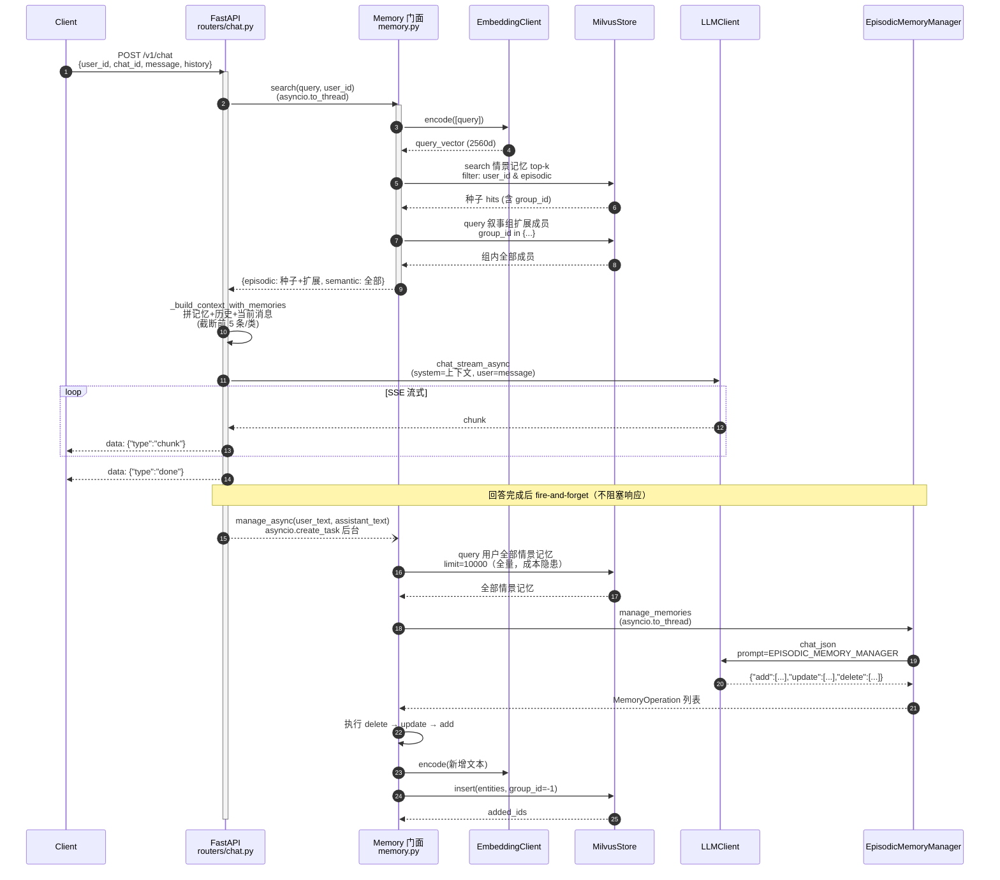
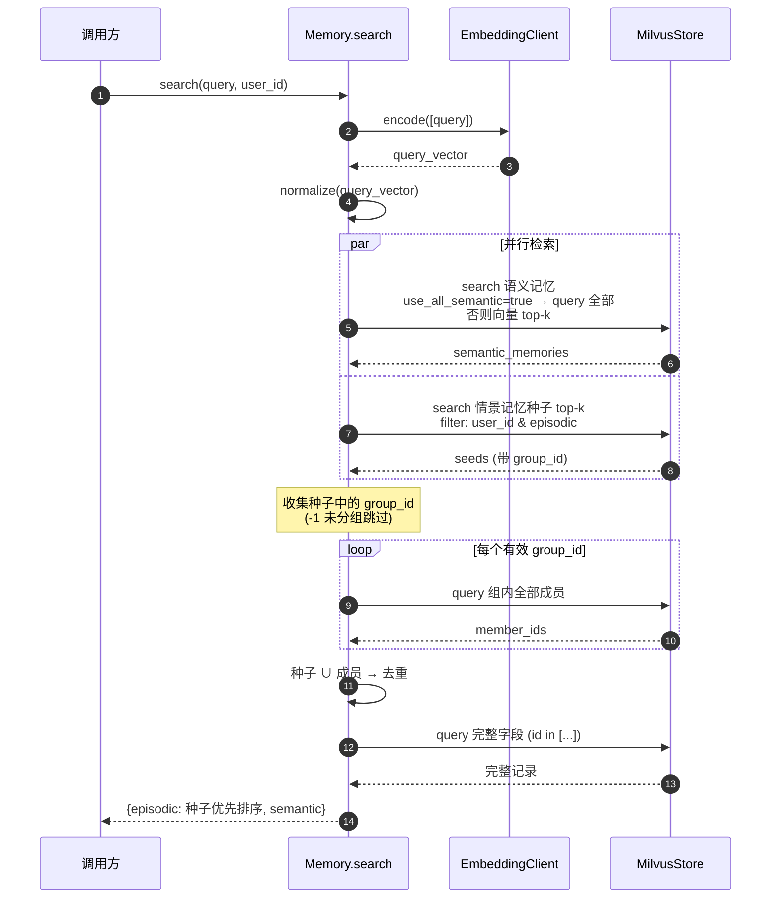
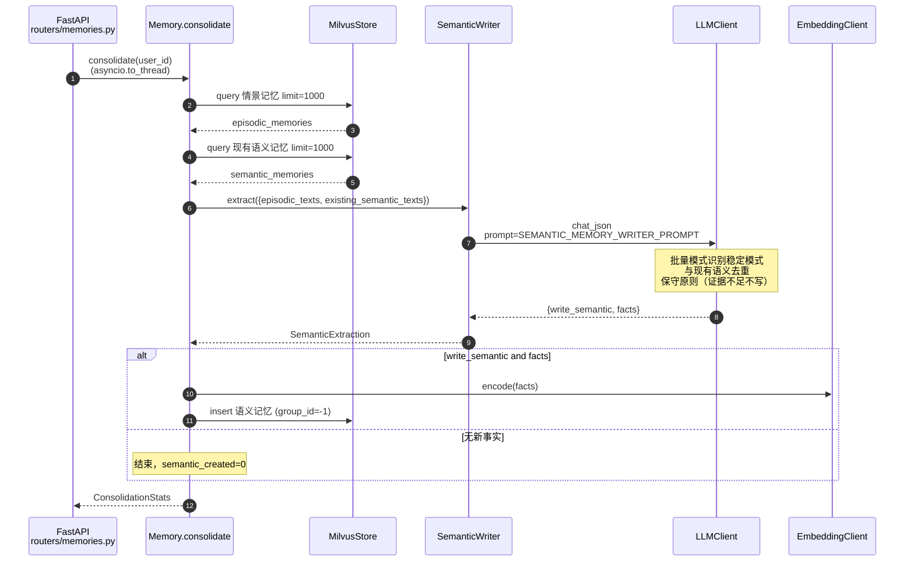

# NeuraMem 核心时序图

> **Goal**: 展示三条核心链路——(A) 记忆增强对话完整闭环；(B) search 混合检索+叙事扩展；(C) consolidate 语义提炼。
> **Type**: Dynamic / Runtime 时序图（现状）
> **Date**: 2025 年

## 图 A：/v1/chat 记忆增强对话闭环

## 图 B：search 内部机制（混合检索 + 叙事组扩展）

## 图 C：consolidate 语义提炼（巩固流程）

## 图例与阅读说明

- 实线 = 同步调用；虚线 = 异步/后台任务；`Note` = 关键机制说明
- 图 A 是产品闭环：检索 → 流式回答 → 自动写记忆；注意 manage 是全量拉取（limit=10000）
- 图 B 展示了叙事扩展的"种子 → 组 → 全成员"三步
- 图 C 展示了巩固阶段的批量模式提炼
